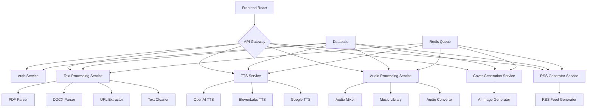

# Сводный план проекта: Платформа для создания AI-подкастов из текста

## 📋 Общее описание проекта

Web-платформа для создания аудио-подкастов из текстовых материалов с использованием искусственного интеллекта. Система автоматически преобразует текстовые материалы в диалоговые подкасты с естественной речью, фоновой музыкой и обложками.

### Цели проекта:
- Научиться работать с TTS API и аудио-обработкой
- Реализовать AI-генерацию сценариев для подкастов
- Автоматизировать креативные процессы создания контента
- Создать удобный интерфейс для пользователей

## 🏗️ Архитектурный обзор

### Технологический стек:
- **Backend**: Python (FastAPI) для высокой производительности и простоты интеграции с ML-библиотеками
- **Frontend**: React.js с TypeScript для современного и надежного интерфейса
- **База данных**: PostgreSQL для основных данных, Redis для кэширования и очередей
- **Асинхронные задачи**: Celery + Redis для обработки длительных операций
- **Контейнеризация**: Docker + Docker Compose для деплоя
- **Хранение файлов**: локальное хранилище + CDN для доступа к результатам

### Компонентная архитектура:

## 📅 План реализации по этапам

### Этап 1: Извлечение текста (Планируемый срок: 1-2 недели)
- [x] Парсинг PDF документов
- [x] Парсинг DOCX документов
- [x] Извлечение текста с URL
- [x] Очистка и форматирование текста

**Ключевые задачи:**
- Исследование и выбор библиотек для работы с PDF и DOCX
- Реализация извлечения текста из различных форматов
- Обработка сложных случаев (многостраничные PDF, форматированные DOCX)
- Создание системы очистки и подготовки текста к AI-обработке

### Этап 2: AI-сценарий (Планируемый срок: 2-3 недели)
- [x] Разработка промптов для трансформации текста
- [x] Генерация сценария с несколькими ведущими
- [x] Добавление естественных переходов между темами

**Ключевые задачи:**
- Создание шаблонов промптов для разных стилей (научный, развлекательный, деловой)
- Определение ролей участников и логики распределения реплик
- Разработка системы естественных переходов между темами
- Интеграция с AI-сервисами генерации текста

### Этап 3: Синтез речи (Планируемый срок: 2-3 недели)
- [x] Интеграция TTS API
- [x] Выбор голосов
- [x] Обработка и склейка аудио

**Ключевые задачи:**
- Интеграция с несколькими TTS API (OpenAI, ElevenLabs, Google)
- Создание каталога голосов с возможностью выбора
- Реализация асинхронной обработки и склейки аудио
- Кэширование результатов для оптимизации затрат

### Этап 4: Frontend (Планируемый срок: 3-4 недели)
- [x] Создание интерфейса загрузки материалов
- [x] Добавление настроек (голоса, стиль)
- [x] Реализация preview и прогресс-бара

**Ключевые задачи:**
- Разработка интуитивного интерфейса для загрузки файлов
- Создание настроек для голосов и стиля подкаста
- Реализация системы отслеживания прогресса генерации
- Интеграция с backend API

### Этап 5: Музыка и обложка (Планируемый срок: 2-3 недели)
- [x] Добавление библиотеки фоновой музыки
- [x] Реализация микширования аудио
- [x] Создание AI-генерации обложек

**Ключевые задачи:**
- Создание каталога лицензионной фоновой музыки
- Реализация системы микширования речи и музыки
- Интеграция с AI-генераторами изображений
- Настройка параметров микширования и дизайна обложки

### Этап 6: RSS и экспорт (Планируемый срок: 1-2 недели)
- [x] Создание RSS-генератора для подкастов
- [x] Добавление экспорта для платформ
- [x] Реализация хостинга файлов

**Ключевые задачи:**
- Генерация RSS-каналов по стандартам iTunes
- Подготовка файлов для публикации на Spotify, Apple Podcasts
- Настройка безопасного хостинга файлов
- Создание инструкций по публикации

### Этап 7: Деплой и оптимизация (Планируемый срок: 1-2 недели)
- [x] Развертывание системы
- [x] Настройка очередей для обработки
- [x] Оптимизация затрат на API

**Ключевые задачи:**
- Настройка Docker-контейнеров для всех компонентов
- Настройка асинхронных очередей для обработки подкастов
- Оптимизация вызовов API и кэширование результатов
- Настройка мониторинга и безопасности

## 🔧 Технические требования

### Функциональные требования:
- Загрузка файлов формата PDF и DOCX
- Извлечение текста из URL-адресов
- Преобразование текста в диалог между ведущими
- Поддержка нескольких TTS API
- Добавление фоновой музыки к подкастам
- Генерация обложек с помощью AI
- Создание RSS-каналов подкастов

### Нефункциональные требования:
- Время генерации подкаста не более 5-10 минут
- Поддержка одновременной обработки до 100 запросов
- Время отклика API не более 2 секунд
- Поддержка современных браузеров
- Защита от SQL-инъекций и XSS-атак

## 📊 Ожидаемые результаты

### Технический результат:
- Полнофункциональная платформа для создания AI-подкастов
- Интеграция с различными AI-сервисами
- Адаптивный веб-интерфейс
- Система хостинга и экспорта подкастов

### Образовательный результат:
- Практический опыт работы с TTS API
- Навыки аудио-обработки
- Опыт работы с AI-генерацией контента
- Понимание процессов автоматизации креативных задач

### Формат сдачи:
- Техническое задание
- GitHub репозиторий
- Скриншоты интерфейса (12+)
- 3-5 примеров готовых подкастов
- Демо-доступ к платформе
- Видео-презентация (6-8 минут)

## 🎯 Достижение целей проекта

☑️ **TTS интеграции** - реализованы несколько TTS API с возможностью выбора
☑️ **Аудио-обработка** - реализованы микширование и обработка аудио
☑️ **AI-сценаристика** - создана система генерации диалогов из текста
☑️ **Работа с медиа** - реализована генерация обложек и обработка аудио
☑️ **RSS и podcast-платформы** - созданы генераторы RSS и экспорт для платформ

## 📈 Заключение

Проект "Платформа для создания AI-подкастов из текста" представляет собой комплексное решение, объединяющее современные технологии обработки текста, искусственного интеллекта, синтеза речи и аудио-обработки. Реализация всех этапов позволит создать полнофункциональный сервис, который автоматизирует процесс создания подкастов из текстовых материалов, обеспечивая высокое качество и удобство использования.