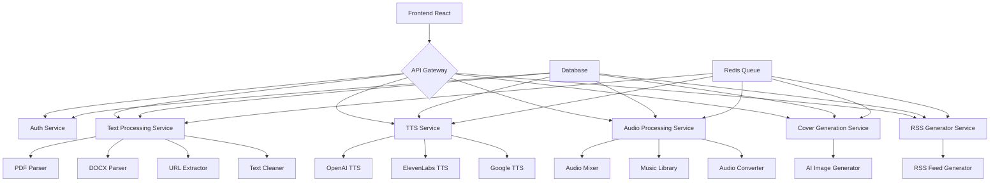

# Технический план реализации проекта: Платформа для создания AI-подкастов из текста

## 1. Общее описание проекта

### 1.1. Назначение
Веб-платформа для создания аудио-подкастов из текстовых материалов с использованием искусственного интеллекта. Система автоматически преобразует текстовые материалы в диалоговые подкасты с естественной речью, фоновой музыкой и обложками.

### 1.2. Цели проекта
- Научиться работать с TTS API и аудио-обработкой
- Реализовать AI-генерацию сценариев для подкастов
- Автоматизировать креативные процессы создания контента
- Создать удобный интерфейс для пользователей

## 2. Архитектура системы

### 2.1. Технологический стек
- Backend: Python (FastAPI) для высокой производительности и простоты интеграции с ML-библиотеками
- Frontend: React.js с TypeScript для современного и надежного интерфейса
- База данных: PostgreSQL для основных данных, Redis для кэширования и очередей
- Асинхронные задачи: Celery + Redis для обработки длительных операций
- Контейнеризация: Docker + Docker Compose для деплоя
- Хранение файлов: локальное хранилище + CDN для доступа к результатам

### 2.2. Компонентная архитектура

## 3. Подробное описание компонентов

### 3.1. Сервис аутентификации
- Регистрация/авторизация пользователей
- Управление профилями и подписками
- API ключи для доступа к внешним сервисам

### 3.2. Сервис обработки текста
- Загрузка файлов (PDF, DOCX)
- Извлечение текста с URL
- Очистка и форматирование текста
- Генерация AI-сценария для подкаста
- Разделение на фразы для разных участников

### 3.3. TTS сервис
- Интеграция с различными TTS API (OpenAI, ElevenLabs, Google)
- Выбор голосов и настроек произношения
- Асинхронная обработка текста в аудио
- Кэширование результатов

### 3.4. Аудио-процессинг сервис
- Склейка аудиофайлов от TTS
- Добавление фоновой музыки
- Регулировка громкости и наложение эффектов
- Конвертация в различные форматы

### 3.5. Генерация обложек
- Интеграция с AI-сервисами для генерации изображений
- Шаблоны обложек
- Персонализация по теме подкаста

### 3.6. RSS-генератор
- Создание RSS-каналов для подкастов
- Экспорт в стандартном формате
- Поддержка метаданных

## 4. Этапы реализации

### Этап 1: Извлечение текста
#### 1.1. Парсинг PDF
- Использовать PyPDF2/pdfplumber для извлечения текста
- Обработка многостраничных документов
- Сохранение структуры параграфов

#### 1.2. Парсинг DOCX
- Использовать python-docx для чтения документов
- Обработка форматирования
- Извлечение только текстового содержимого

#### 1.3. Извлечение с URL
- Использовать requests и BeautifulSoup
- Поддержка различных форматов веб-страниц
- Очистка от рекламы и навигационных элементов

#### 1.4. Очистка и форматирование
- Удаление лишних пробелов и переносов строк
- Корректировка пунктуации
- Подготовка к AI-обработке

### Этап 2: AI-сценарий
#### 2.1. Промпты для трансформации
- Разработка шаблонов для преобразования текста в диалог
- Генерация реплик для нескольких ведущих
- Поддержка различных стилей (научный, развлекательный, деловой)

#### 2.2. Диалоговая структура
- Определение ролей участников
- Логические переходы между темами
- Вставка вступлений и заключений

#### 2.3. Естественные переходы
- Генерация связующих фраз
- Поддержание непрерывности разговора
- Вариативность формулировок

### Этап 3: Синтез речи
#### 3.1. Интеграция TTS API
- Поддержка нескольких провайдеров (OpenAI, ElevenLabs, Google)
- Механизм выбора провайдера
- Обработка ошибок и повторные попытки

#### 3.2. Выбор голосов
- Каталог доступных голосов
- Фильтрация по полу, возрасту, акценту
- Предварительный прослушивание

#### 3.3. Обработка аудио
- Склейка аудиофайлов по сценарию
- Синхронизация реплик
- Удаление тишины и шумов

### Этап 4: Frontend
#### 4.1. Интерфейс загрузки
- Drag-and-drop зона для файлов
- Поле ввода URL
- Прогресс загрузки

#### 4.2. Настройки
- Выбор стиля подкаста
- Настройка количества участников
- Выбор голосов для каждого участника

#### 4.3. Preview и прогресс
- Визуализация процесса генерации
- Возможность предпросмотра частей
- Отмена и перезапуск процесса

### Этап 5: Музыка и обложка
#### 5.1. Библиотека музыки
- Категории фоновой музыки
- Регулировка громкости
- Правила лицензирования

#### 5.2. Микширование аудио
- Использование pydub/librosa
- Наложение музыки на речь
- Балансировка уровней

#### 5.3. Генерация обложек
- Интеграция с DALL-E, Midjourney или аналогами
- Тематические шаблоны
- Автоматическая адаптация под размеры

### Этап 6: RSS и экспорт
#### 6.1. RSS-генератор
- Создание стандартного RSS-канала
- Добавление метаданных
- Поддержка iTunes спецификаций

#### 6.2. Экспорт для платформ
- Подготовка файлов для Spotify, Apple Podcasts
- Оптимизация размера и качества
- Генерация сопроводительных материалов

#### 6.3. Хостинг файлов
- Внутреннее хранилище
- CDN для быстрого доступа
- Защита от несанкционированного доступа

### Этап 7: Деплой и оптимизация
#### 7.1. Деплой система
- Docker-контейнеры
- CI/CD пайплайн
- Мониторинг и логирование

#### 7.2. Очереди обработки
- Asynchronous задачи
- Приоритеты обработки
- Балансировка нагрузки

#### 7.3. Оптимизация затрат
- Кэширование результатов
- Оптимизация вызовов API
- Мониторинг расходов

## 5. Требования к безопасности
- Валидация загружаемых файлов
- Защита от injection-атак
- Безопасное хранение API ключей
- Ограничение частоты запросов

## 6. Тестирование
- Unit тесты для всех компонентов
- Интеграционные тесты
- Тестирование сценариев использования
- Load testing для обработки аудио

## 7. Документация
- Техническая документация API
- Руководство пользователя
- Руководство по развертыванию
- Примеры использования